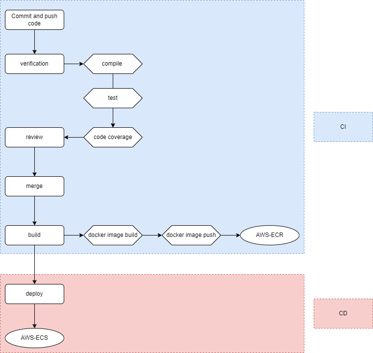

# CI-CD process
## Description

Describing process of pushing code to git repository, verification, tests, review, build and deploy processes over that code.

## Goal

Ability to deliver features quickly to production with high quality and frequency 

## CI-CD steps

- developer machine -->
- push to git (compile, test, code-coverage)  --> 
- review (git)--> 
- merge --> 
- build (docker image build, docker image push --> (AWS-ECR)) --> 
- deploy (AWS-ECS)

## Instruments

AWS-ECR for hosting docker container images

AWS-ECS for managing docker containers

Docker for containerization application

Github for storing source code and for version control

## Diagrams

