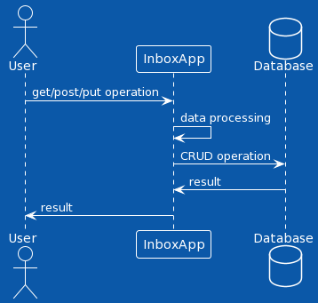

# Inbox management
## Description
There is a central element in the system named INBOX that holds all the items inside and represents a
list with additional functionality (will be described in separate sections below). As a general features of
the inbox there are: adding item, removing item, prioritizing items, etc.

## Diagrams



[Open in PlantUml](../diagrams/appDiagram.puml)


## Features
### Add item to inbox
With help of this feature user can add new item to the inbox.
## REST API
````
    https://inbox.com/item
````

## Data Model
For more details, please refer to the data [design section](#Data-design)

## Table InboxItem

| Column      | Type          | Description                                         |
|-------------|---------------|-----------------------------------------------------|
| id          | UUID          | Used as unique identifier                           |
| name        | String        | Name of the item                                    |
| description | String        | Item description                                    |
| created     | LocalDateTime | Created time of item                                |
| updated     | LocalDateTime | Updated time of item                                |
| status      | String        | Status of item (ACTIVE, INACTIVE, UNKNOWN, DELETED) |


## Data design