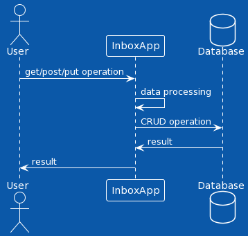

# Add Item method
## Description
Add a new items in the Inbox space

## Documents Collection Syntax
````
object.Add(item);
````
## Parameters

    item  = The object what we need to save to DB

## What the function Returns

    saved object in DB

## Diagrams

 

## REST-API

````
items/add
````

